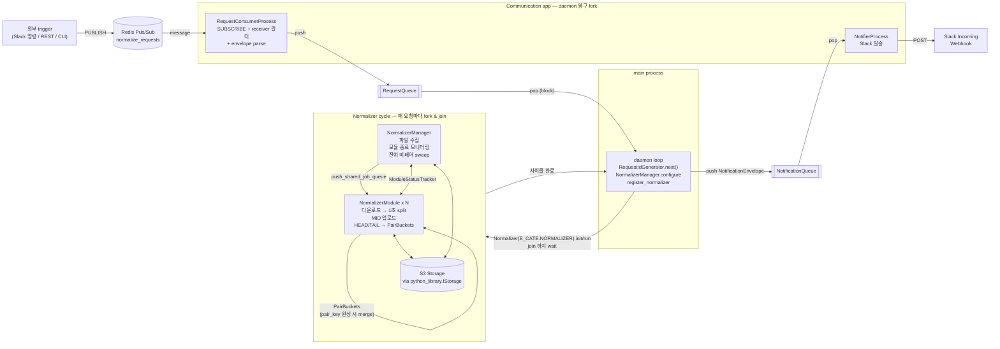

# sensor-data-normalization

PCAP 기반 센서 데이터 정규화 파이프라인.

## 빌드 / 실행

```sh
uv sync

# daemon — Redis Pub/Sub 채널 normalize_requests 를 SUBSCRIBE
uv run python src/normalizer_app.py
```

워커 수는 `conf/application.conf` 의 `[NORMALIZER].WORKER_COUNT` 로 설정한다. argv 인자 없음 — 모든 정규화 입력(receiver / date / vehicle_id / selected_device / notify_channel)은 Redis pub/sub message body 에서 받는다 (아래 "외부 trigger" 참조).

## 외부 trigger (Redis Pub/Sub message)

외부 시스템(Slack 명령/REST/CLI)이 conf `[REDIS].CHANNEL_NAME` 채널로 PUBLISH 하면 daemon 이 SUBSCRIBE 로 수신한다. `envelope.receiver` 가 daemon 의 conf `[REDIS].RECEIVER` 와 일치할 때만 처리. message body 는 pydantic `NormalizationRequest` schema 의 JSON.

```sh
redis-cli PUBLISH normalize_requests '{"receiver":"normalizer","date":"20260514","vehicle_id":"VEHICLE-001"}'
```

| 필드 | 필수 | 설명 |
| --- | --- | --- |
| `receiver` | ✅ | daemon 의 `[REDIS].RECEIVER` 와 일치해야 처리 (라우팅 키) |
| `date` | ✅ | YYYYMMDD |
| `vehicle_id` | | 빈 문자열이면 해당 날짜 전체 처리 |
| `selected_device` | | 생략 시 conf `[SELECTED_DEVICE].SELECTED` |
| `notify_channel` | | 생략 시 conf `[NOTIFICATION].DEFAULT_CHANNEL` |

처리 시 daemon 이 `req-YYYYMMDD-HHMMSS-{uuid8}` 형식의 `request_id` 를 자동 발급하고, 완료/실패 시 Slack Incoming Webhook 으로 알림 전송.

> Pub/Sub 특성상 daemon 이 SUBSCRIBE 중이 아닌 시점의 message 는 손실됨 (재요청 필요). 손실 보호가 필요하면 Redis Stream + consumer group 으로 전환.

## 디렉토리 구조

```
sensor-data-normalization/
├── conf/
│   ├── application.conf
│   └── logging.conf
├── src/
│   ├── normalizer_app.py                # 진입점
│   ├── app/
│   │   ├── app_object.py                # IApp / abApp / MultiProcessManagerApp[FromCate]
│   │   ├── normalizer/process/          # 매 사이클 fork
│   │   │   ├── manager/manager.py       # NormalizerManager (QueueProcessing, 파일 수집·잔여 sweep)
│   │   │   └── module/module.py         # NormalizerModule (QueueProcessing, 다운로드/분할/업로드)
│   │   └── communication/process/       # daemon 시작 시 영구 fork
│   │       ├── consumer/consumer_process.py   # RequestConsumerProcess (poll → RequestQueue push)
│   │       └── notifier/notifier_process.py   # NotifierProcess (NotificationQueue pop → Slack)
│   ├── common/
│   │   ├── event_bus/listener/normalization_request_listener.py  # pubsub.get_message + receiver 필터 (replayer event_bus/listener 패턴)
│   │   ├── process_state/{pair_buckets, module_status, request_queue, notification_queue}.py  # cross-process 큐·상태
│   │   ├── protocol/{normalization_request, request_id}.py # pydantic envelope + 시퀀스
│   │   └── notification/{notification_sender, slack_webhook_notifier}.py  # Slack 알림
│   ├── process_category/
│   │   ├── enum_category.py             # E_CATE.NORMALIZER + E_CATE.COMMUNICATION
│   │   └── process_category.py          # register_normalizer (워커 N 동적) + register_communication
│   ├── sensor_category/
│   │   ├── enum_sensor.py               # E_SENSOR_TYPE, E_LIDAR, E_CAMERA, E_GNSS
│   │   └── sensor_registry.py           # SensorRegistry 싱글톤 (모듈명 → sensor_type)
│   ├── config/
│   │   └── project_config.py            # ProjectConfig (AppConfig 상속)
│   ├── pcap/                            # replayer src/pcaps/ 차용 + 응용 추가
│   │   ├── headers/{file_header,packet_header}.py     # 24B FileHeader / 16B PacketHeader (time_stamp)
│   │   ├── body/{ethernet,linux_sll*,ip_header,pcap_body*}.py  # protocol layer parse
│   │   ├── reader/{single,multi}.py     # PcapReader (file/packet header + body parse)
│   │   ├── {packet,pool,time_info,constants}.py
│   │   ├── packet_position.py           # E_PACKET_POSITION (HEAD/MID/TAIL)
│   │   ├── splitter.py                  # IPcapSplitter / SplitedPcap / SplitOutcome
│   │   ├── local_pcap_splitter.py       # LocalPcapSplitter (1초 split + merge, raw bytes 기반)
│   │   ├── pcap_filename_parser.py      # PcapFilenameParser (파일명 → module/date/hours/minutes)
│   │   └── unprocessed_pcap.py          # @dataclass(frozen=True) UnprocessedPcap
└── pyproject.toml
```

## 아키텍처



**라이프사이클 단위**

| 단위 | 무엇 | 언제 fork |
|---|---|---|
| **Communication app** (RequestConsumerProcess + NotifierProcess) | Redis pub/sub 수신 + Slack 발송 | daemon 시작 시 1회. 영구 |
| **Normalizer cycle** (NormalizerManager + NormalizerModule × N) | 한 요청의 정규화 처리 | 매 요청마다 fork → join → 종료 |
| **main process** | RequestQueue ↔ NotificationQueue 중재 + 사이클 트리거 | daemon 자체 |

## 데이터 흐름

1. `main()` → ProjectConfig + logging → `Communication(E_CATE.COMMUNICATION).init()` 으로 영구 process 2개 (RequestConsumerProcess + NotifierProcess) fork
2. main loop: `RequestQueue.pop()` 대기
3. `RequestConsumerProcess` 가 Redis pub/sub 채널 SUBSCRIBE → message 수신 → `NormalizationRequest` parse + receiver 필터 → `RequestQueue.push()`
4. main: request_id 발급 → `NormalizerManager.configure(request_id, date, vehicle_id, selected_device)` (ClassVar)
5. `ProcessCategory.register_normalizer()` (사이클별 재호출) → `Normalizer(E_CATE.NORMALIZER)` 인스턴스 → 매니저 1 + 모듈 N 사이클 fork
6. `NormalizerManager`/`NormalizerModule` 가 처리 → 잔여 sweep → 모두 stop → `MultiProcessManager.join()`
7. `Normalizer.run()` 의 `is_running()` 폴링이 끝남 → main 으로 복귀
8. 결과를 `NotificationQueue.push(envelope)` → `NotifierProcess` 가 pop → Slack 발송
9. 다음 요청 대기 (SIGTERM/SIGINT 시 graceful shutdown)

## 동시성 모델

multi-process 채택. 벤치마크(`scripts/bench_io_vs_cpu.py`) 결과 합성 IO+CPU 워크로드에서
process가 thread 대비 모든 worker count(1/2/4/8)에서 동등 또는 우세 (Python 표준
파일 IO가 의외로 GIL-bound이기 때문). 워커 결선·종료는 `python_library.MultiProcessManager`
의 자동 결선(`set_shared_job_queue` / `set_shared_queue` / `join`)을 그대로 사용.
