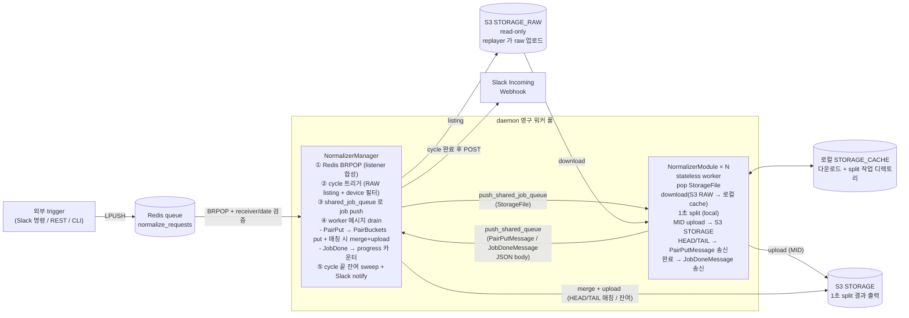

# sensor-data-normalization

PCAP 기반 센서 데이터 정규화 파이프라인.

## 빌드 / 실행

```sh
uv sync

# (dev) replayer 의 raw 를 normalization 이 읽을 S3 RAW 구조로 업로드
uv run python scripts/upload_raw_to_s3.py --dry-run   # 먼저 결과 path 확인
uv run python scripts/upload_raw_to_s3.py             # 실제 업로드

# daemon — Redis queue normalize_requests 를 BRPOP
uv run python src/main.py
```

워커 수는 `conf/application.conf` 의 `[NORMALIZER].WORKER_COUNT` 로 설정한다. argv 인자 없음 — 모든 정규화 입력(receiver / date / vehicle_id / selected_device)은 Redis queue 메시지 body 에서 받는다 (아래 "외부 trigger" 참조).

## 외부 trigger (Redis queue)

외부 시스템(Slack 명령/REST/CLI)이 conf `[REDIS].CHANNEL_NAME` 키 queue 에 `LPUSH` 하면 daemon 이 `BRPOP` 으로 꺼낸다. `envelope.receiver` 가 daemon 의 conf `[REDIS].RECEIVER` 와 일치할 때만 처리 (불일치 시 destructive pop + 로그 drop). message body 는 `NormalizationRequest` dataclass (`abMessage` 상속) 의 JSON.

```sh
redis-cli LPUSH normalize_requests '{"receiver":"normalizer","date":"20260514","vehicle_id":"VEHICLE-001"}'
```

| 필드 | 필수 | 설명 |
| --- | --- | --- |
| `protocol_id` | | 생략 시 `"NORMALIZATION_REQUEST"` default |
| `sender` | | 생략 시 `"CLIENT"` default |
| `receiver` | ✅ | daemon 의 `[REDIS].RECEIVER` 와 일치해야 처리 (라우팅 키) |
| `request_id` | | 생략 시 envelope parse 시점에 `req-YYYYMMDD-HHMMSS-{uuid8}` 자동 발급 |
| `date` | ✅ | YYYYMMDD — listener 가 boundary 에서 정규식 검증 |
| `vehicle_id` | | 빈 문자열이면 해당 날짜 전체 처리 |
| `selected_device` | | 생략 시 conf `[SELECTED_DEVICE].SELECTED` |

완료/실패 시 `INotificationSender` 구현체가 알림 전송. **현재 개발 단계 기본값은 `LogNotifier`** — Slack 발송 없이 logger 로만 `[NOTIFY_SUCCESS]` / `[NOTIFY_FAILURE]` 기록. Slack 전환은 [manager.py](src/app/normalizer/process/manager/manager.py) 에서 `SlackWebhookNotifier()` 로 교체 + `conf [NOTIFICATION].WEBHOOK_URL` 실제 hook URL 입력.

> queue (Redis LIST) 는 영속이라 daemon 이 down 인 동안 LPUSH 된 메시지도 다음 BRPOP 에서 그대로 꺼냄. ACK / 재처리 / replay 가 필요해지면 Redis Streams + consumer group 으로 전환 (현재 use case 는 단순 queue 로 충분).

## 디렉토리 구조

```
sensor-data-normalization/
├── conf/
│   ├── application.conf
│   └── logging.conf
├── src/
│   ├── main.py                          # 진입점 (ProjectConfig.set_config → MultiProcessManager 에 Manager+Module×N append → run)
│   ├── app/normalizer/process/          # daemon 영구 워커 풀
│   │   ├── manager/manager.py           # NormalizerManager — Redis poll + cycle + IPC drain + merge + notify
│   │   └── module/module.py             # NormalizerModule × N — stateless: download → 1초 split → MID upload + manager 로 PairPut/JobDone 메시지 송신
│   ├── listener/
│   │   └── normalization_request_listener.py  # Redis BRPOP + receiver/date 검증 (manager 합성)
│   ├── notification/
│   │   ├── notification_sender.py       # INotificationSender 인터페이스
│   │   ├── log_notifier.py              # dev 기본값 — logger 로 [NOTIFY_*] 기록
│   │   └── slack_webhook_notifier.py    # prod — Slack Incoming Webhook
│   ├── process_state/                   # manager 단독 owner (Singleton 아님, plain object)
│   │   ├── pair_buckets.py              # PairBuckets — HEAD/TAIL 쌍 누적 + 매칭 시 merge 대상 반환
│   │   └── job_progress.py              # JobProgressTracker — cycle 완료 카운터
│   ├── protocol/                        # 외부/IPC 메시지 정의 + ProtocolMeta registry
│   │   ├── message.py                   # IMessage(ABC) + abMessage(frozen dataclass — protocol_id/sender/receiver 공통 헤더)
│   │   ├── protocol_meta.py             # E_PROTOCOL_ID enum + ProtocolMeta(Singleton) decoder/factory registry
│   │   ├── normalization_request.py     # 외부 입력 envelope (abMessage 상속 dataclass)
│   │   ├── pair_put.py                  # PairPutMessage (worker → manager)
│   │   ├── job_done.py                  # JobDoneMessage (worker → manager)
│   │   └── request_id.py                # RequestIdGenerator
│   ├── sensor_category/
│   │   ├── enum_sensor.py               # E_SENSOR_TYPE, E_LIDAR, E_CAMERA, E_GNSS
│   │   └── sensor_registry.py           # SensorRegistry 싱글톤 (모듈명 → sensor_type)
│   ├── config/
│   │   └── project_config.py            # ProjectConfig (AppConfig 상속, Singleton)
│   └── pcap/                            # replayer src/pcaps/ 차용 + 응용 추가
│       ├── headers/{file_header,packet_header}.py     # 24B FileHeader / 16B PacketHeader (time_stamp)
│       ├── body/{ethernet,linux_sll*,ip_header,pcap_body*}.py  # protocol layer parse
│       ├── reader/{single,multi}.py     # PcapReader (file/packet header + body parse)
│       ├── {packet,pool,time_info,constants}.py
│       ├── packet_position.py           # E_PACKET_POSITION (HEAD/MID/TAIL)
│       ├── splitter.py                  # IPcapSplitter / SplitedPcap / SplitOutcome
│       ├── local_pcap_splitter.py       # LocalPcapSplitter (1초 split + merge, raw bytes 기반)
│       ├── pcap_filename_parser.py      # PcapFilenameParser (파일명 → module/date/hours/minutes)
│       └── unprocessed_pcap.py          # @dataclass(frozen=True) UnprocessedPcap
└── pyproject.toml
```

## 아키텍처



**스토리지 레이아웃 (conf/application.conf)**

| conf | 역할 | 형식 | 예시 |
|---|---|---|---|
| `[STORAGE_RAW]` | S3 raw 입력 (read-only) — Manager 가 listing/download 소스 | `s3://<ROOT>/<PREFIX>` (boto3 path 는 `/bucket/key`) | `s3://oncx-dev-common-assets-bucket/test/raw` |
| `[STORAGE_CACHE]` | 로컬 작업 디렉토리 — Module 의 download 결과 + LocalPcapSplitter 출력 | 로컬 절대 path | `/data1/sensor-data-normalization/cache` |
| `[STORAGE]` | S3 정규화 출력 — 1초 split 의 MID + pair merge 결과 | S3 path | `s3://oncx-dev-common-assets-bucket/test/split` |
| `[STORAGE_UNPAIRED_MERGE]` | 로컬 임시 — HEAD/TAIL 짝 merge 중간 산출 | 로컬 절대 path | `/data1/sensor-data-normalization/unpaired_merge` |

**라이프사이클 단위**

| 단위 | 무엇 | 언제 시작 |
|---|---|---|
| **main process** | `main.py` — `MultiProcessManager` 에 Manager+Module×N append → `run()` 으로 spawn + join 대기. 부모는 자식 의존성 inherit 안 함 (fork-inherit 의존 X) | daemon 진입점 |
| **NormalizerManager** | Redis poll + cycle 오케스트레이션 + IPC drain + Slack notify + `PairBuckets`/`JobProgressTracker` 단독 owner | daemon 시작 시 1회. 영구 |
| **NormalizerModule × N** | shared_job_queue → 다운로드/split/업로드, stateless worker. 결과는 manager 에 IPC 메시지로 보고 | daemon 시작 시 1회. 영구 |

## 메시지 시스템 (protocol/)

모든 외부/IPC 메시지가 `IMessage` 인터페이스 + `abMessage` 베이스 + `ProtocolMeta` registry 위에서 일관 처리.

```
IMessage (ABC)                       ← to_json / from_json 계약
  └─ abMessage (frozen dataclass)    ← protocol_id / sender / receiver 공통 헤더
       ├─ NormalizationRequest       ← 외부 입력 (Redis 큐)
       ├─ PairPutMessage             ← worker → manager IPC
       └─ JobDoneMessage             ← worker → manager IPC
```

- `E_PROTOCOL_ID` enum 이 모든 protocol_id 의 single source of truth
- 각 메시지 dataclass 의 `protocol_id` instance field default 가 enum.value 참조
- `ProtocolMeta(Singleton)` 가 `protocol_id → ProtocolEntry(decoder, factory)` registry. envelope 없이 body 의 `protocol_id` 로 dispatch
- 새 메시지 추가 시 (a) `E_PROTOCOL_ID` 에 enum 항목 (b) `abMessage` 상속 dataclass + `to_json`/`from_json` (c) `ProtocolMeta._register_protocols` 한 줄

## 데이터 흐름

1. `main()` → `ProjectConfig.set_config` (path 만) → `MultiProcessManager` 에 `NormalizerManager()` + `NormalizerModule(idx)` × `worker_count` append → `process_manager.run()` (자식 spawn + join 대기)
2. 각 자식 프로세스 진입 직후 `run()` → `on_init()` 1회: `ProjectConfig` / `SensorRegistry` / `AppLogger` / storage / splitter / listener / notifier 명시 setup. 그 다음 `while not is_stop(): action()` 루프
3. **Manager.action()**: `listener.poll(timeout=1.0)` 으로 Redis BRPOP. 메시지 없으면 다음 tick. 메시지 도착 시 listener 가 `NormalizationRequest.from_json` + receiver/date 검증 통과시킨 후 반환
4. **Manager `_handle_request` → `_run_cycle`**:
   - `_collect_file_list(date, vehicle_id)` → S3 RAW listing
   - `_filter_by_device(...)` → selected_device 로 필터
   - `PairBuckets()` 재생성 (cycle 잔여 초기화) + `JobProgressTracker.begin_cycle(N)`
   - 각 StorageFile 을 `push_shared_job_queue` 로 push
   - `_drain_worker_messages()` → manager 의 mailbox 에서 IPC 메시지 drain
5. **Module.action()** (영구 루프):
   - `pop_shared_job_queue()` → StorageFile 받음 (없으면 idle sleep)
   - `_process_file`: 다운로드 → 1초 split → MID 업로드
   - HEAD/TAIL 조각마다 `PairPutMessage` 를 manager mailbox 로 송신
   - 처리 완료 시 (성공/실패) `JobDoneMessage` 송신
6. **Manager drain 루프** (`is_done()` 까지):
   - `PairPutMessage` → `self._pair_buckets.put(...)`. 매칭 (2개) 되면 즉시 `_merge_pair` → S3 업로드
   - `JobDoneMessage` → `self._progress.mark_one_done(...)`
7. 카운터 0 도달 → drain 종료 → `PairBuckets.pop_all_remaining()` 으로 잔여(unmatched HEAD/TAIL) sweep + 단독 업로드
8. `notifier.notify_success/_failure` 로 Slack 발송 → Manager.action() 복귀 → 다음 tick

## 동시성 모델

multi-process 채택. 벤치마크(`scripts/bench_io_vs_cpu.py`) 결과 합성 IO+CPU 워크로드에서
process가 thread 대비 모든 worker count(1/2/4/8)에서 동등 또는 우세 (Python 표준
파일 IO가 의외로 GIL-bound이기 때문)

영구 워커 풀 패턴: Manager + Module × N 을 daemon 시작 시 **한 번만** spawn 하고 영구 실행(서버 모델).
