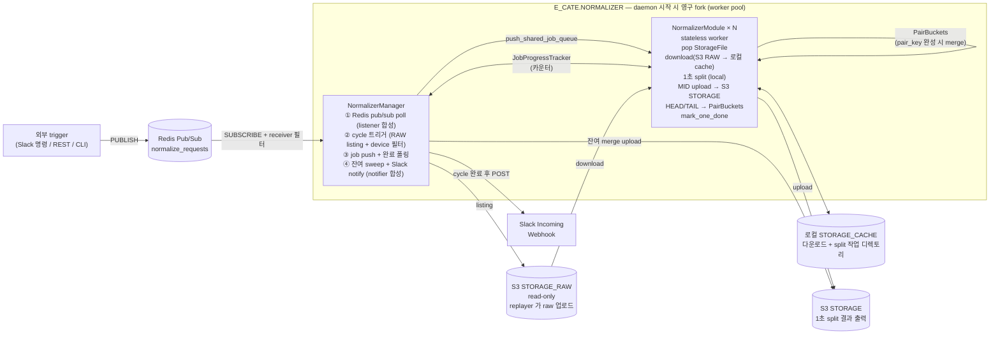

# sensor-data-normalization

PCAP 기반 센서 데이터 정규화 파이프라인.

## 빌드 / 실행

```sh
uv sync

# (dev) replayer 의 raw 를 normalization 이 읽을 S3 RAW 구조로 업로드
uv run python scripts/upload_raw_to_s3.py --dry-run   # 먼저 결과 path 확인
uv run python scripts/upload_raw_to_s3.py             # 실제 업로드

# daemon — Redis Pub/Sub 채널 normalize_requests 를 SUBSCRIBE
uv run python src/main.py
```

워커 수는 `conf/application.conf` 의 `[NORMALIZER].WORKER_COUNT` 로 설정한다. argv 인자 없음 — 모든 정규화 입력(receiver / date / vehicle_id / selected_device / notify_channel)은 Redis pub/sub message body 에서 받는다 (아래 "외부 trigger" 참조).

## 외부 trigger (Redis Pub/Sub message)

외부 시스템(Slack 명령/REST/CLI)이 conf `[REDIS].CHANNEL_NAME` 채널로 PUBLISH 하면 daemon 이 SUBSCRIBE 로 수신한다. `envelope.receiver` 가 daemon 의 conf `[REDIS].RECEIVER` 와 일치할 때만 처리. message body 는 pydantic `NormalizationRequest` schema 의 JSON.

```sh
redis-cli PUBLISH normalize_requests '{"receiver":"normalizer","date":"20260514","vehicle_id":"VEHICLE-001"}'
```

| 필드 | 필수 | 설명 |
| --- | --- | --- |
| `request_id` | | 생략 시 envelope parse 시점에 `req-YYYYMMDD-HHMMSS-{uuid8}` 자동 발급 |
| `receiver` | ✅ | daemon 의 `[REDIS].RECEIVER` 와 일치해야 처리 (라우팅 키) |
| `date` | ✅ | YYYYMMDD |
| `vehicle_id` | | 빈 문자열이면 해당 날짜 전체 처리 |
| `selected_device` | | 생략 시 conf `[SELECTED_DEVICE].SELECTED` |
| `notify_channel` | | 생략 시 conf `[NOTIFICATION].DEFAULT_CHANNEL` |

완료/실패 시 `INotificationSender` 구현체가 알림 전송. **현재 개발 단계 기본값은 `LogNotifier`** — Slack 발송 없이 logger 로만 `[NOTIFY_SUCCESS]` / `[NOTIFY_FAILURE]` 기록. Slack 전환은 [manager.py](src/app/normalizer/process/manager/manager.py) 에서 `SlackWebhookNotifier()` 로 교체 + `conf [NOTIFICATION].WEBHOOK_URL` 실제 hook URL 입력.

> Pub/Sub 특성상 daemon 이 SUBSCRIBE 중이 아닌 시점의 message 는 손실됨 (재요청 필요). cycle 진행 중에도 Redis 클라이언트 버퍼가 메시지를 보유하지만 버퍼 크기 한계가 있음. 손실 보호가 필요하면 Redis Stream + consumer group 으로 전환.

## 디렉토리 구조

```
sensor-data-normalization/
├── conf/
│   ├── application.conf
│   └── logging.conf
├── src/
│   ├── main.py                          # 진입점 (config 로드 → ProcessCategory.register → app fork → run)
│   ├── app/
│   │   ├── app_object.py                # IApp / abApp / MultiProcessManagerApp[FromCate]
│   │   └── normalizer/process/          # E_CATE.NORMALIZER — daemon 시작 시 영구 fork
│   │       ├── manager/manager.py       # NormalizerManager (Redis sub poll + cycle 트리거 + Slack notify, listener/notifier 합성)
│   │       └── module/module.py         # NormalizerModule × N (stateless 워커: shared_job_queue → 다운로드/분할/업로드, mark_one_done)
│   ├── common/
│   │   ├── event_bus/listener/normalization_request_listener.py  # pubsub.get_message + receiver 필터 (Manager 가 composition 으로 사용)
│   │   ├── process_state/{pair_buckets, job_progress}.py         # cross-process 상태 (PairBuckets / JobProgressTracker 카운터)
│   │   ├── protocol/{normalization_request, request_id}.py       # pydantic envelope + 시퀀스
│   │   └── notification/{notification_sender, log_notifier, slack_webhook_notifier}.py  # 알림 (dev=LogNotifier, prod=SlackWebhookNotifier)
│   ├── process_category/
│   │   ├── enum_category.py             # E_CATE.NORMALIZER → COMMON(Manager) + MODULE(Module × N)
│   │   └── process_category.py          # register_normalizer (worker_count 기반 module fanout)
│   ├── sensor_category/
│   │   ├── enum_sensor.py               # E_SENSOR_TYPE, E_LIDAR, E_CAMERA, E_GNSS
│   │   └── sensor_registry.py           # SensorRegistry 싱글톤 (모듈명 → sensor_type)
│   ├── config/
│   │   └── project_config.py            # ProjectConfig (AppConfig 상속)
│   ├── pcap/                            # replayer src/pcaps/ 차용 + 응용 추가
│   │   ├── headers/{file_header,packet_header}.py     # 24B FileHeader / 16B PacketHeader (time_stamp)
│   │   ├── body/{ethernet,linux_sll*,ip_header,pcap_body*}.py  # protocol layer parse
│   │   ├── reader/{single,multi}.py     # PcapReader (file/packet header + body parse)
│   │   ├── {packet,pool,time_info,constants}.py
│   │   ├── packet_position.py           # E_PACKET_POSITION (HEAD/MID/TAIL)
│   │   ├── splitter.py                  # IPcapSplitter / SplitedPcap / SplitOutcome
│   │   ├── local_pcap_splitter.py       # LocalPcapSplitter (1초 split + merge, raw bytes 기반)
│   │   ├── pcap_filename_parser.py      # PcapFilenameParser (파일명 → module/date/hours/minutes)
│   │   └── unprocessed_pcap.py          # @dataclass(frozen=True) UnprocessedPcap
└── pyproject.toml
```

## 아키텍처



**스토리지 레이아웃 (conf/application.conf)**

| conf | 역할 | 형식 | 예시 |
|---|---|---|---|
| `[STORAGE_RAW]` | S3 raw 입력 (read-only) — Manager 가 listing/download 소스 | `s3://<ROOT>/<PREFIX>` (boto3 path 는 `/bucket/key`) | `s3://oncx-dev-common-assets-bucket/test/raw` |
| `[STORAGE_CACHE]` | 로컬 작업 디렉토리 — Module 의 download 결과 + LocalPcapSplitter 출력 | 로컬 절대 path | `/data1/sensor-data-normalization/cache` |
| `[STORAGE]` | S3 정규화 출력 — 1초 split 의 MID + pair merge 결과 | S3 path | `s3://oncx-dev-common-assets-bucket/test/split` |
| `[STORAGE_UNPAIRED_MERGE]` | 로컬 임시 — HEAD/TAIL 짝 merge 중간 산출 | 로컬 절대 path | `/data1/sensor-data-normalization/unpaired_merge` |

**라이프사이클 단위**

| 단위 | 무엇 | 언제 fork |
|---|---|---|
| **NormalizerManager** | Redis sub poll + cycle 오케스트레이션 + Slack notify (cycle 컨텍스트는 매 cycle 마다 instance field 로 set, ClassVar 없음) | daemon 시작 시 1회. 영구 |
| **NormalizerModule × N** | shared_job_queue → 다운로드/split/업로드, stateless worker (cycle 컨텍스트는 file path 에서 derive) | daemon 시작 시 1회. 영구 |
| **main process** | ProjectConfig + logging + cross-process singleton 부모 inherit | daemon 자체 (register + app.init/run 만) |

## 데이터 흐름

1. `main()` → ProjectConfig + logging → `PairBuckets`/`JobProgressTracker` 부모 instance 화 (fork 시 자식 inherit) → `ProcessCategory.register_normalizer()` (worker_count 기반 트리 구성) → `Normalizer(E_CATE.NORMALIZER).init()` 으로 영구 process (Manager + Module × N) 일괄 fork → `app.run()`
2. NormalizerManager.action(): `listener.poll(timeout=1.0)` 으로 Redis pub/sub 채널 polling. 메시지 없으면 다음 tick.
3. 메시지 도착: `NormalizationRequest` parse (`request_id` 미지정 시 envelope `default_factory` 가 발급) + receiver 필터 통과
4. Manager `_handle_request` → `_run_cycle`:
   - `_collect_file_list(date, vehicle_id)` → S3 에서 파일 목록 수집
   - `_filter_by_device(...)` → selected_device 로 필터
   - `JobProgressTracker.begin_cycle(N)` → 카운터 세팅
   - 각 StorageFile 을 `push_shared_job_queue` 로 push
   - `_wait_for_completion()` → `progress.is_done()` 폴링
5. NormalizerModule.action() (영구 루프):
   - `pop_shared_job_queue()` → StorageFile 받음 (없으면 idle sleep)
   - `_process_file` 다운로드 → 1초 split → MID 업로드 → HEAD/TAIL 은 PairBuckets 누적
   - `JobProgressTracker.mark_one_done()`
6. 카운터 0 도달 → Manager 가 `PairBuckets.pop_all_remaining()` 으로 잔여 sweep + 업로드
7. Manager 가 `notifier.notify_success/_failure` 로 Slack 발송
8. Manager.action() 복귀 → 다음 tick (Redis poll 재개). Module 들은 그대로 idle 상태로 대기.

## 동시성 모델

multi-process 채택. 벤치마크(`scripts/bench_io_vs_cpu.py`) 결과 합성 IO+CPU 워크로드에서
process가 thread 대비 모든 worker count(1/2/4/8)에서 동등 또는 우세 (Python 표준
파일 IO가 의외로 GIL-bound이기 때문). 워커 결선·종료는 `python_library.MultiProcessManager`
의 자동 결선(`set_shared_job_queue` / `set_shared_queue` / `join`)을 그대로 사용.

영구 워커 풀 패턴: Manager + Module × N 을 daemon 시작 시 **한 번만** fork 하고 영구 실행한다.
요청마다 fork-join 하지 않으므로 fork overhead 가 사이클 latency 에 들어가지 않는다 (서버 모델).
